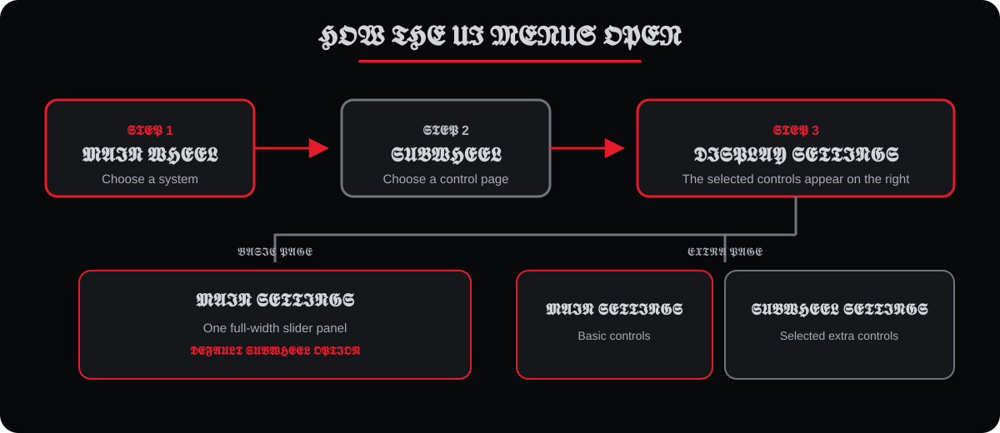

<div align="center">
  

  **A free, all-in-one driving control and camera app for Assetto Corsa.**

  `v3.10.0` · `Lua` · `Custom Shaders Patch`
</div>

## 𝖂𝖍𝖆𝖙 𝖎𝖙 𝖉𝖔𝖊𝖘

CPC Drive Suite puts clutch assistance, launch control, automatic gear tracking, cockpit camera and FOV motion, Dynamic 6DOF NeckFX, telemetry, presets, and a configurable driver HUD into one accessible wheel-based menu. It is made with love for the community and is completely free.

## 𝕳𝖎𝖌𝖍𝖑𝖎𝖌𝖍𝖙𝖘

- Adaptive clutch, anti-stall, launch, handbrake, drift-kick, and shift controls.
- Synchronized throttle-driven cockpit movement and FOV response.
- Dynamic 6DOF NeckFX with position, rotation, response, and follow controls.
- Automatic gear tracking, shift timing, live telemetry, and four HUD layouts.
- Five full-menu color themes with resizable wheels, labels, and a 1280×720 mode.
- JSON settings import, export, editable defaults, presets, and per-control reset.

## 𝕴𝖓𝖘𝖙𝖆𝖑𝖑

### 𝕰𝖆𝖘𝖞 𝖎𝖓𝖘𝖙𝖆𝖑𝖑

1. Close Assetto Corsa and Content Manager.
2. Extract the release ZIP into the Assetto Corsa installation folder.
3. Allow Windows to merge the included `apps` and `extension` folders.
4. Enable **CPC Drive Suite** in Content Manager/CSP.
5. Select **CPC Drive Suite - NeckFX Backend** in CSP's scripted NeckFX settings, then reload the session.

### 𝕬𝖕𝖕 𝖔𝖓𝖑𝖞

Copy this repository to:

```text
assettocorsa/apps/lua/cpc_drive_suite/
```

The companion backend is required only for Dynamic 6DOF NeckFX. The other systems can run without it.

## 𝕼𝖚𝖎𝖈𝖐 𝖘𝖙𝖆𝖗𝖙

1. Open the app and press **Home** in the main wheel.
2. Enable the suite and the systems you want.
3. Use the main wheel for a system and the subwheel below it for a control page.
4. Adjust basic controls in the first slider column; added subwheel controls open to its right.
5. Right-click a slider to restore its default value.

The full UI targets 2560×1440. Use the button below the wheel-size and title-size sliders to switch to the smaller 1280×720 layout.

## 𝕸𝖊𝖓𝖚 𝖋𝖑𝖔𝖜

<div align="center">
  
</div>

## 𝕽𝖊𝖖𝖚𝖎𝖗𝖊𝖒𝖊𝖓𝖙𝖘

- Assetto Corsa for Windows.
- Custom Shaders Patch with Lua app support.
- CSP control overrides for clutch and automatic-gear features.
- The matching CPC NeckFX backend for Dynamic 6DOF output.

## 𝕾𝖊𝖙𝖙𝖎𝖓𝖌𝖘

- `CPC_DRIVE_SUITE_SETTINGS.JSON` stores current user settings.
- `CPC_DRIVE_SUITE_DEFAULTS.JSON` stores editable startup and reset defaults.
- The Home page can save, load, preview, and open the settings folder.

## 𝕱𝖚𝖑𝖑 𝖕𝖗𝖔𝖏𝖊𝖈𝖙 𝖘𝖙𝖗𝖚𝖈𝖙𝖚𝖗𝖊

```text
cpc_drive_suite/
├── actions/
│   ├── arcade_overdrive.lua
│   ├── clutch_speed_helpers.lua
│   └── suite_presets.lua
├── autogear/
│   ├── tracker_runtime.lua
│   └── tracker_update.lua
├── assets/
│   ├── cpc-drive-suite-banner.svg
│   └── ui-menu-flow.svg
├── clutch/
│   ├── adaptive_control.lua
│   ├── launch_adaptive.lua
│   └── runtime_isolation.lua
├── hud/
│   ├── circular_gauges.lua
│   ├── circular_minimal_window.lua
│   ├── pedals_full_dashboard.lua
│   └── telemetry_primitives.lua
├── neck/
│   ├── connection_sync.lua
│   └── telemetry_controls.lua
├── presets/
│   ├── camera_fov.lua
│   ├── clutch_camera.lua
│   ├── hud_autogear.lua
│   └── neckfx.lua
├── settings/
│   ├── advanced_motion_defaults.lua
│   ├── clutch_camera_defaults.lua
│   ├── final_migrations.lua
│   ├── neck_ui_defaults.lua
│   └── storage_migrations.lua
├── throttle/
│   ├── camera_output_fov.lua
│   ├── camera_session.lua
│   ├── camera_update_motion.lua
│   ├── linear_dynamics.lua
│   └── runtime_channels.lua
├── ui/
│   ├── appearance_modes.lua
│   ├── chrome_navigation.lua
│   ├── clutch_gear_pages.lua
│   ├── common_controls.lua
│   ├── navigation_tree.lua
│   ├── neck_simple_pages.lua
│   ├── sidebar_home.lua
│   ├── sliders_presets.lua
│   ├── throttle_advanced_pages.lua
│   ├── throttle_pages.lua
│   └── window_callbacks.lua
├── CPC_DRIVE_SUITE_DEFAULTS.JSON
├── CPC_DRIVE_SUITE_SETTINGS.JSON
├── INSTALL.txt
├── README.md
├── cpc_drive_suite.lua
├── cpc_drive_suite_actions.lua
├── cpc_drive_suite_autogear.lua
├── cpc_drive_suite_clutch.lua
├── cpc_drive_suite_core.lua
├── cpc_drive_suite_hud.lua
├── cpc_drive_suite_lifecycle.lua
├── cpc_drive_suite_math.lua
├── cpc_drive_suite_neck.lua
├── cpc_drive_suite_presets.lua
├── cpc_drive_suite_settings.lua
├── cpc_drive_suite_settings_file.lua
├── cpc_drive_suite_theme.lua
├── cpc_drive_suite_throttle.lua
├── cpc_drive_suite_ui.lua
├── icon.png
├── manifest.ini
└── source_loader.lua
```

The feature folders contain short Lua source fragments. `source_loader.lua` assembles them into regular modules at runtime.

Generated installation and backup ZIP archives are release artifacts, so they are not included in the repository source tree above.

## 𝕿𝖗𝖔𝖚𝖇𝖑𝖊𝖘𝖍𝖔𝖔𝖙𝖎𝖓𝖌

- **Backend offline:** Select the CPC backend in scripted NeckFX, enable it, and reload the session.
- **No camera movement:** Use cockpit view, enable throttle camera, press **Rebase Camera / FOV**, and disable conflicting camera apps.
- **Clutch or gears unavailable:** Confirm CSP control overrides are supported and disable overlapping assistance apps.
- **Menu error:** Check the safe-loader message and verify every folder and Lua fragment was copied.

## 𝕷𝖎𝖈𝖊𝖓𝖘𝖊

No license file is currently included. Add a license before redistributing modified versions or accepting external contributions.
